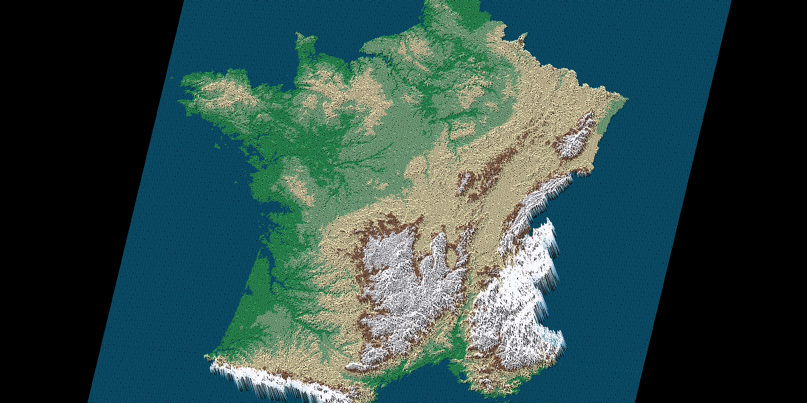

# Fdf - 42/Unit Factory

This project create program, which display 3D maps of .fdf type files.

This project work only MacOS system.
Used graphic "MiniLibX" library.

1. Use "make" to compile program.
2. run ./fdf test_maps/[choose_file].fdf

# CONTROLS:

# turn:

'W' - OX up

'S' - OX down

'A' - OY left

'D' - OY right

'Q' - OZ underclock

'E' - OZ onclock

# Move:

'up' - Up

'down' - Down

'left' - Left

'right' - Righ

'~' - to center

# Zoom:

'+' or '-' - Small zoom

'`[`' or ']' - Big zoom

# 'esc' - Exit
